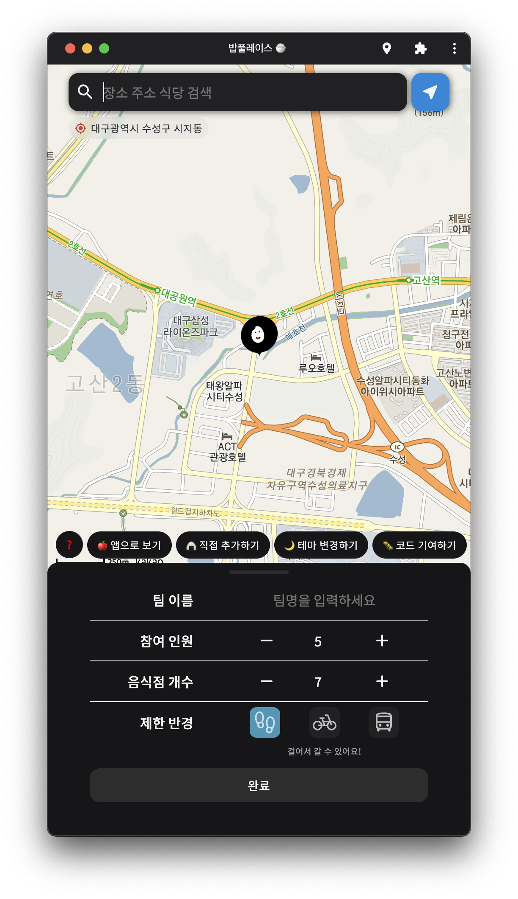

<div width="100%" height="100%" align="center">

<h1 align="center">
🍚
</h1>

<p align="center">
  <h3 align="center"> 밥풀레이스 </h3>
  <a href="CONTRIBUTING.md#pull-requests"></a>
  
  </p>

<b>오늘은 어디서 밥먹지? 🍚</b></br>
가고싶은 식당에 투표해 친구들과 공유해보세요!

</div>

<br><br><br>

# Useage

1. 식당을 찾을 위치, 팀 이름 등 원하는 옵션으로 설정
2. 함께 점심을 먹을 팀원들에게 링크 전송
3. 투표 결과 확인!

<p float="left">


</p>

<br><br><br>

# Code

### 연관 프로젝트

- [babplace-backend](https://github.com/BabPlace/babplace-backend)
- [babplace-webpush-server](https://github.com/BabPlace/babplace-webpush-server)

<br>

### 디렉토리 구조

```shell
.
├── public
│   ├── favicons
│   ├── icons
│   └── splashscreens
└── src
    ├── components
    ├── context
    ├── controller
    ├── hooks
    ├── icons
    ├── interfaces
    ├── layouts
    ├── lib
    ├── pages
    ├── styles
    └── theme
```

<br><br>

### 핵심 기능

- [PWA](https://github.com/BabPlace/babplace-web-client/blob/b8a7b3e935ace2469e0cf45af1485e638a9b1037/next.config.js#L14-L26)
- [push notification](https://github.com/BabPlace/babplace-web-client/blob/b8a7b3e935ace2469e0cf45af1485e638a9b1037/public/sw_with_push_manager.js#L37-L62)
- [service worker caching](https://github.com/BabPlace/babplace-web-client/blob/b8a7b3e935ace2469e0cf45af1485e638a9b1037/public/sw_with_push_manager.js#L2-L30C1)
- [dynamic import](https://github.com/BabPlace/babplace-web-client/blob/b8a7b3e935ace2469e0cf45af1485e638a9b1037/src/components/pages/gola/Gola.tsx#L111-L114)
- [css module](./src/styles/)
- [css token, prefer-color-scheme, data-theme](./src/styles/globals.css)

<br><br>

# Test

```shell
git clone https://github.com/BabPlace/babplace-web-client
```

> 밥풀레이스 로컬 테스트를 진행하기 위해선 kakaomap api 등록이 필요합니다.

```text
# .env file
NEXT_PUBLIC_KAKAO_MAP_API_KEY="여기에 키를 넣으세요"
```

빌드, 실행하기

```shell
yarn dev
or
yarn build
yarn start
```

<br><br>

# Contribute

이슈 및 PR을 원하시는 분들은 자유롭게 올려주세요 :)
